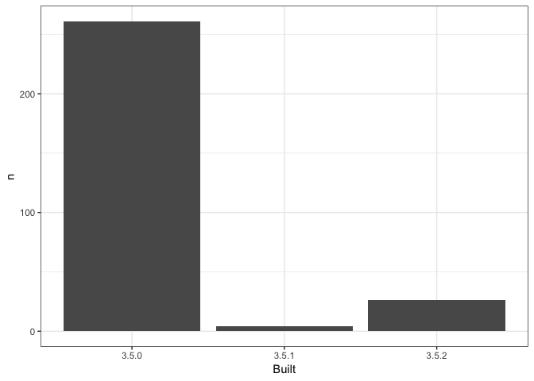

03\_barchart-packages-built.R
================
Thomas
Tue Jan 15 17:21:07 2019

``` r
## remember to restart R here!

library(tidyverse)
```

    ## ── Attaching packages ───────────────────────────── tidyverse 1.2.1 ──

    ## ✔ ggplot2 3.1.0     ✔ purrr   0.2.5
    ## ✔ tibble  2.0.1     ✔ dplyr   0.7.8
    ## ✔ tidyr   0.8.2     ✔ stringr 1.3.1
    ## ✔ readr   1.3.1     ✔ forcats 0.3.0

    ## ── Conflicts ──────────────────────────────── tidyverse_conflicts() ──
    ## ✖ dplyr::filter() masks stats::filter()
    ## ✖ dplyr::lag()    masks stats::lag()

``` r
## make a barchart from the frequency table in data/add-on-packages-freqtable.csv

## read that csv into a data frame
## hint: readr::read_csv() or read.csv()
## idea: try using here::here() to create the file path

apt_freqtable <- read_csv(here::here("data/add-on-packages-freqtable.csv"))
```

    ## Parsed with column specification:
    ## cols(
    ##   Built = col_character(),
    ##   n = col_double(),
    ##   prop = col_double()
    ## )

``` r
## if you use ggplot2, code like this will work:
ggplot(apt_freqtable, aes(x = Built, y = n)) +
  geom_col() +
  theme_bw()
```



``` r
## write this barchart to figs/built-barchart.png
## if you use ggplot2, ggsave() will help
## idea: try using here::here() to create the file path

ggsave(here::here("figs/built-barchart.png"))
```

    ## Saving 7 x 5 in image

``` r
## YES overwrite the file that is there now
## that's old output from me (Jenny)

devtools::session_info()
```

    ## ─ Session info ──────────────────────────────────────────────────────────
    ##  setting  value                       
    ##  version  R version 3.5.2 (2018-12-20)
    ##  os       macOS High Sierra 10.13.6   
    ##  system   x86_64, darwin15.6.0        
    ##  ui       X11                         
    ##  language (EN)                        
    ##  collate  en_US.UTF-8                 
    ##  ctype    en_US.UTF-8                 
    ##  tz       America/Chicago             
    ##  date     2019-01-15                  
    ## 
    ## ─ Packages ──────────────────────────────────────────────────────────────
    ##  package     * version date       lib source        
    ##  assertthat    0.2.0   2017-04-11 [1] CRAN (R 3.5.0)
    ##  backports     1.1.3   2018-12-14 [1] CRAN (R 3.5.0)
    ##  bindr         0.1.1   2018-03-13 [1] CRAN (R 3.5.0)
    ##  bindrcpp      0.2.2   2018-03-29 [1] CRAN (R 3.5.0)
    ##  broom         0.5.1   2018-12-05 [1] CRAN (R 3.5.0)
    ##  callr         3.1.1   2018-12-21 [1] CRAN (R 3.5.1)
    ##  cellranger    1.1.0   2016-07-27 [1] CRAN (R 3.5.0)
    ##  cli           1.0.1   2018-09-25 [1] CRAN (R 3.5.0)
    ##  colorspace    1.4-0   2019-01-13 [1] CRAN (R 3.5.2)
    ##  crayon        1.3.4   2017-09-16 [1] CRAN (R 3.5.0)
    ##  desc          1.2.0   2018-05-01 [1] CRAN (R 3.5.0)
    ##  devtools      2.0.1   2018-10-26 [1] CRAN (R 3.5.2)
    ##  digest        0.6.18  2018-10-10 [1] CRAN (R 3.5.0)
    ##  dplyr       * 0.7.8   2018-11-10 [1] CRAN (R 3.5.0)
    ##  evaluate      0.12    2018-10-09 [1] CRAN (R 3.5.0)
    ##  forcats     * 0.3.0   2018-02-19 [1] CRAN (R 3.5.0)
    ##  fs            1.2.6   2018-08-23 [1] CRAN (R 3.5.0)
    ##  generics      0.0.2   2018-11-29 [1] CRAN (R 3.5.0)
    ##  ggplot2     * 3.1.0   2018-10-25 [1] CRAN (R 3.5.0)
    ##  glue          1.3.0   2018-07-17 [1] CRAN (R 3.5.0)
    ##  gtable        0.2.0   2016-02-26 [1] CRAN (R 3.5.0)
    ##  haven         2.0.0   2018-11-22 [1] CRAN (R 3.5.0)
    ##  here          0.1     2017-05-28 [1] CRAN (R 3.5.0)
    ##  highr         0.7     2018-06-09 [1] CRAN (R 3.5.0)
    ##  hms           0.4.2   2018-03-10 [1] CRAN (R 3.5.0)
    ##  htmltools     0.3.6   2017-04-28 [1] CRAN (R 3.5.0)
    ##  httr          1.4.0   2018-12-11 [1] CRAN (R 3.5.0)
    ##  jsonlite      1.6     2018-12-07 [1] CRAN (R 3.5.0)
    ##  knitr         1.21    2018-12-10 [1] CRAN (R 3.5.2)
    ##  labeling      0.3     2014-08-23 [1] CRAN (R 3.5.0)
    ##  lattice       0.20-38 2018-11-04 [1] CRAN (R 3.5.0)
    ##  lazyeval      0.2.1   2017-10-29 [1] CRAN (R 3.5.0)
    ##  lubridate     1.7.4   2018-04-11 [1] CRAN (R 3.5.0)
    ##  magrittr      1.5     2014-11-22 [1] CRAN (R 3.5.0)
    ##  memoise       1.1.0   2017-04-21 [1] CRAN (R 3.5.0)
    ##  modelr        0.1.2   2018-05-11 [1] CRAN (R 3.5.0)
    ##  munsell       0.5.0   2018-06-12 [1] CRAN (R 3.5.0)
    ##  nlme          3.1-137 2018-04-07 [1] CRAN (R 3.5.2)
    ##  pillar        1.3.1   2018-12-15 [1] CRAN (R 3.5.0)
    ##  pkgbuild      1.0.2   2018-10-16 [1] CRAN (R 3.5.0)
    ##  pkgconfig     2.0.2   2018-08-16 [1] CRAN (R 3.5.0)
    ##  pkgload       1.0.2   2018-10-29 [1] CRAN (R 3.5.0)
    ##  plyr          1.8.4   2016-06-08 [1] CRAN (R 3.5.0)
    ##  prettyunits   1.0.2   2015-07-13 [1] CRAN (R 3.5.0)
    ##  processx      3.2.1   2018-12-05 [1] CRAN (R 3.5.0)
    ##  ps            1.3.0   2018-12-21 [1] CRAN (R 3.5.1)
    ##  purrr       * 0.2.5   2018-05-29 [1] CRAN (R 3.5.0)
    ##  R6            2.3.0   2018-10-04 [1] CRAN (R 3.5.0)
    ##  Rcpp          1.0.0   2018-11-07 [1] CRAN (R 3.5.0)
    ##  readr       * 1.3.1   2018-12-21 [1] CRAN (R 3.5.1)
    ##  readxl        1.2.0   2018-12-19 [1] CRAN (R 3.5.0)
    ##  remotes       2.0.2   2018-10-30 [1] CRAN (R 3.5.0)
    ##  rlang         0.3.1   2019-01-08 [1] CRAN (R 3.5.2)
    ##  rmarkdown     1.11    2018-12-08 [1] CRAN (R 3.5.0)
    ##  rprojroot     1.3-2   2018-01-03 [1] CRAN (R 3.5.0)
    ##  rstudioapi    0.9.0   2019-01-09 [1] CRAN (R 3.5.2)
    ##  rvest         0.3.2   2016-06-17 [1] CRAN (R 3.5.0)
    ##  scales        1.0.0   2018-08-09 [1] CRAN (R 3.5.0)
    ##  sessioninfo   1.1.1   2018-11-05 [1] CRAN (R 3.5.0)
    ##  stringi       1.2.4   2018-07-20 [1] CRAN (R 3.5.0)
    ##  stringr     * 1.3.1   2018-05-10 [1] CRAN (R 3.5.0)
    ##  testthat      2.0.1   2018-10-13 [1] CRAN (R 3.5.0)
    ##  tibble      * 2.0.1   2019-01-12 [1] CRAN (R 3.5.2)
    ##  tidyr       * 0.8.2   2018-10-28 [1] CRAN (R 3.5.0)
    ##  tidyselect    0.2.5   2018-10-11 [1] CRAN (R 3.5.0)
    ##  tidyverse   * 1.2.1   2017-11-14 [1] CRAN (R 3.5.0)
    ##  usethis       1.4.0   2018-08-14 [1] CRAN (R 3.5.0)
    ##  withr         2.1.2   2018-03-15 [1] CRAN (R 3.5.0)
    ##  xfun          0.4     2018-10-23 [1] CRAN (R 3.5.0)
    ##  xml2          1.2.0   2018-01-24 [1] CRAN (R 3.5.0)
    ##  yaml          2.2.0   2018-07-25 [1] CRAN (R 3.5.0)
    ## 
    ## [1] /Library/Frameworks/R.framework/Versions/3.5/Resources/library
